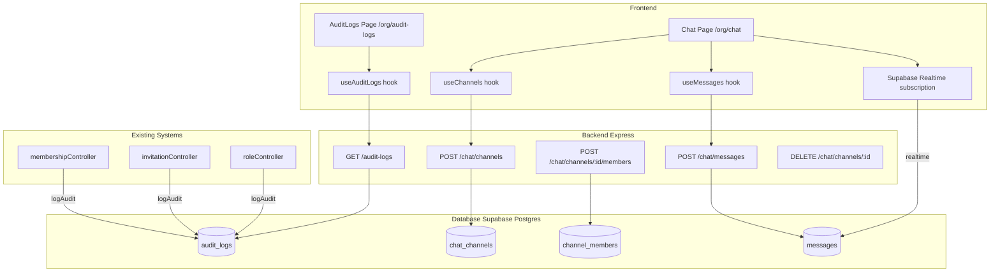
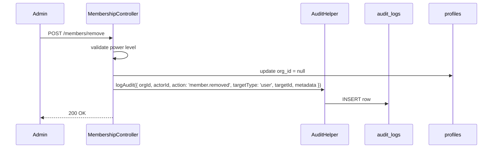
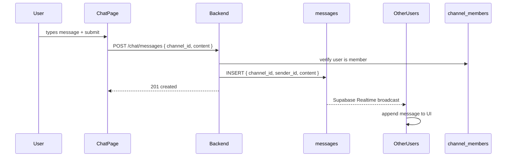
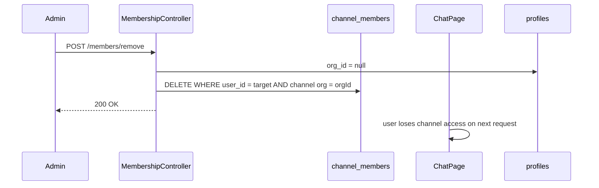

# Design Document: Audit Logs & Team Chat System

## Overview

This feature extends the Aurix platform with two complementary capabilities: a structured audit log system that records all critical org-level actions for admin review, and a real-time team chat system that enables org members to communicate through persistent channels. Both features are scoped to organizations, gated by RBAC, and integrate with the existing membership and invitation lifecycle.

The audit log system provides a tamper-evident trail of who did what and when — covering membership changes, role assignments, invitation events, and org settings updates. The team chat system provides Slack-like channel-based messaging with Supabase Realtime for live updates, with access controlled at both the org and channel level.

## Architecture



## Sequence Diagrams

### Audit Log: Member Removed Flow



### Chat: Send Message Flow



### Chat: User Removed from Org Cascade



## Components and Interfaces

### Component 1: AuditLog Backend Helper

**Purpose**: Centralized helper called by all controllers to write audit events.

**Interface**:
```typescript
interface LogAuditParams {
  orgId: string
  actorId: string
  action: AuditAction
  targetType: 'user' | 'org' | 'invitation' | 'role' | 'channel'
  targetId: string
  metadata?: Record<string, unknown>
}

type AuditAction =
  | 'member.joined'
  | 'member.left'
  | 'member.removed'
  | 'member.banned'
  | 'member.unbanned'
  | 'invite.sent'
  | 'invite.accepted'
  | 'invite.rejected'
  | 'role.changed'
  | 'org.updated'
  | 'settings.updated'
  | 'channel.created'
  | 'channel.deleted'
  | 'channel.member_added'
  | 'channel.member_removed'

function logAudit(params: LogAuditParams): Promise<void>
```

**Responsibilities**:
- Fire-and-forget insert into `audit_logs` table
- Never throws — errors are logged and swallowed so they don't break the calling controller
- Replaces the existing `auditLog()` helper in `membershipController.js`

### Component 2: Audit Logs API Route

**Purpose**: Paginated, filterable read endpoint for audit logs.

**Interface**:
```typescript
// GET /api/audit-logs
// Query params:
interface AuditLogsQuery {
  action?: AuditAction       // filter by action type
  actor_id?: string          // filter by who performed the action
  from?: string              // ISO date string
  to?: string                // ISO date string
  page?: number              // default 1
  limit?: number             // default 50, max 200
}

interface AuditLogEntry {
  id: string
  org_id: string
  actor_id: string
  actor_name: string         // joined from profiles
  actor_email: string
  action: AuditAction
  target_type: string
  target_id: string
  target_name?: string       // resolved display name when possible
  metadata: Record<string, unknown>
  created_at: string
}
```

**Responsibilities**:
- Requires `admin` or `super_admin` role
- Scoped to `req.user.orgId` — no cross-org leakage
- Joins `profiles` to resolve actor name/email

### Component 3: Chat Channels API

**Purpose**: CRUD for channels and membership management.

**Interface**:
```typescript
// POST /api/chat/channels
interface CreateChannelBody {
  name: string   // 1-50 chars, alphanumeric + hyphens
}

// POST /api/chat/channels/:channelId/members
interface AddMemberBody {
  user_id: string
}

// DELETE /api/chat/channels/:channelId/members/:userId
// DELETE /api/chat/channels/:channelId
```

**Responsibilities**:
- Channel creation: `admin` or `super_admin` only
- Add/remove members: `admin` or `super_admin` only
- Channel deletion cascades to `messages` and `channel_members` via DB foreign keys
- All operations scoped to `req.user.orgId`

### Component 4: Messages API

**Purpose**: Insert messages; reads happen via Supabase Realtime + direct Supabase client queries.

**Interface**:
```typescript
// POST /api/chat/messages
interface SendMessageBody {
  channel_id: string
  content: string            // 1-4000 chars
  attachments?: string[]     // optional array of storage URLs
}
```

**Responsibilities**:
- Verify sender is a member of the channel via `channel_members`
- Verify sender is an active org member (not banned)
- Insert into `messages` table
- Supabase Realtime handles delivery to subscribers

### Component 5: AuditLogs Frontend Page

**Purpose**: Admin-only page at `/org/audit-logs` showing filterable audit trail.

**Interface**:
```typescript
interface AuditLogsPageProps {}

// Filters state
interface AuditFilters {
  action: string
  actorId: string
  from: string
  to: string
}
```

**Responsibilities**:
- Redirect non-admin users to `/`
- Table with columns: Actor, Action badge, Target, Timestamp
- Filter bar: action type dropdown, user search, date range pickers
- Expandable row → renders `metadata` as formatted JSON
- Pagination (50 per page)
- Uses TanStack Query with `useAuditLogs` hook

### Component 6: Chat Frontend Page

**Purpose**: Full-page chat UI at `/org/chat`.

**Interface**:
```typescript
interface ChatPageProps {}

interface Channel {
  id: string
  name: string
  org_id: string
  created_by: string
  created_at: string
  unread_count?: number
}

interface Message {
  id: string
  channel_id: string
  sender_id: string
  sender_name: string
  sender_avatar?: string
  content: string
  attachments?: string[]
  created_at: string
}
```

**Responsibilities**:
- Left sidebar: channel list, active channel highlight, unread badge, "New Channel" button (admin only)
- Main area: virtualized message list, auto-scroll to bottom on new message
- Message input: textarea with Enter-to-send (Shift+Enter for newline)
- Supabase Realtime subscription on `messages` filtered by `channel_id`
- Unsubscribe and resubscribe when active channel changes

## Data Models

### audit_logs

```sql
CREATE TABLE audit_logs (
  id          uuid PRIMARY KEY DEFAULT gen_random_uuid(),
  org_id      uuid NOT NULL REFERENCES organizations(id) ON DELETE CASCADE,
  actor_id    uuid NOT NULL REFERENCES profiles(id) ON DELETE SET NULL,
  action      text NOT NULL,
  target_type text NOT NULL,
  target_id   uuid,
  metadata    jsonb DEFAULT '{}',
  created_at  timestamptz NOT NULL DEFAULT now()
);

CREATE INDEX idx_audit_logs_org_id     ON audit_logs(org_id);
CREATE INDEX idx_audit_logs_actor_id   ON audit_logs(actor_id);
CREATE INDEX idx_audit_logs_action     ON audit_logs(action);
CREATE INDEX idx_audit_logs_created_at ON audit_logs(created_at DESC);
```

**Validation Rules**:
- `action` must be one of the defined `AuditAction` enum values
- `target_type` must be one of: `user`, `org`, `invitation`, `role`, `channel`
- `metadata` defaults to `{}` — never null

### chat_channels

```sql
CREATE TABLE chat_channels (
  id          uuid PRIMARY KEY DEFAULT gen_random_uuid(),
  org_id      uuid NOT NULL REFERENCES organizations(id) ON DELETE CASCADE,
  name        text NOT NULL,
  created_by  uuid NOT NULL REFERENCES profiles(id) ON DELETE SET NULL,
  created_at  timestamptz NOT NULL DEFAULT now(),
  UNIQUE(org_id, name)
);

CREATE INDEX idx_chat_channels_org_id ON chat_channels(org_id);
```

**Validation Rules**:
- `name`: 1–50 chars, lowercase alphanumeric + hyphens only
- Unique per org (no duplicate channel names within same org)

### channel_members

```sql
CREATE TABLE channel_members (
  id          uuid PRIMARY KEY DEFAULT gen_random_uuid(),
  channel_id  uuid NOT NULL REFERENCES chat_channels(id) ON DELETE CASCADE,
  user_id     uuid NOT NULL REFERENCES profiles(id) ON DELETE CASCADE,
  joined_at   timestamptz NOT NULL DEFAULT now(),
  UNIQUE(channel_id, user_id)
);

CREATE INDEX idx_channel_members_channel_id ON channel_members(channel_id);
CREATE INDEX idx_channel_members_user_id    ON channel_members(user_id);
```

**Validation Rules**:
- User must be an active org member at time of addition
- Unique constraint prevents duplicate membership

### messages

```sql
CREATE TABLE messages (
  id           uuid PRIMARY KEY DEFAULT gen_random_uuid(),
  channel_id   uuid NOT NULL REFERENCES chat_channels(id) ON DELETE CASCADE,
  sender_id    uuid NOT NULL REFERENCES profiles(id) ON DELETE SET NULL,
  content      text NOT NULL CHECK (char_length(content) BETWEEN 1 AND 4000),
  attachments  text[] DEFAULT '{}',
  created_at   timestamptz NOT NULL DEFAULT now()
);

CREATE INDEX idx_messages_channel_id  ON messages(channel_id);
CREATE INDEX idx_messages_created_at  ON messages(created_at DESC);
```

**Validation Rules**:
- `content`: 1–4000 characters
- `attachments`: array of valid storage URLs (validated at application layer)

## Error Handling

### Error Scenario 1: Non-admin accesses audit logs

**Condition**: User with role `manager`, `developer`, `support`, or `client` navigates to `/org/audit-logs` or calls `GET /api/audit-logs`
**Response**: Frontend redirects to `/`. Backend returns `403 Forbidden`.
**Recovery**: User is silently redirected; no error toast shown.

### Error Scenario 2: User sends message to channel they're not a member of

**Condition**: `POST /api/chat/messages` where sender is not in `channel_members`
**Response**: `403 Forbidden` — "You are not a member of this channel"
**Recovery**: Frontend removes the channel from the sidebar and shows a toast.

### Error Scenario 3: User removed from org while in chat

**Condition**: Admin removes a user; that user has an active chat session
**Response**: Supabase Realtime connection remains open but subsequent message sends return 403. The `useOrgMembersRealtime` hook (already in place) triggers logout.
**Recovery**: User is logged out and redirected to login. Channel membership is cleaned up server-side.

### Error Scenario 4: Channel deleted while members are viewing it

**Condition**: Admin deletes a channel that has active viewers
**Response**: Realtime subscription receives a DELETE event on `chat_channels`. Frontend detects the active channel was deleted.
**Recovery**: Frontend auto-selects the first available channel or shows an empty state with "Channel was deleted" message.

### Error Scenario 5: Audit log write fails

**Condition**: DB insert into `audit_logs` fails (network issue, constraint violation)
**Response**: Error is caught and logged via `logger.warn()`. The parent operation (e.g., remove member) still succeeds.
**Recovery**: No user-facing impact. Ops team can monitor via server logs.

### Error Scenario 6: Banned user attempts to send message

**Condition**: A banned user somehow retains a valid JWT and calls `POST /api/chat/messages`
**Response**: `authenticate` middleware fetches profile; banned users have `org_id = null`, so `requireOrg` returns `403`.
**Recovery**: Request is rejected. No message is stored.

## Testing Strategy

### Unit Testing Approach

- `logAudit()` helper: verify it inserts correct fields, verify it swallows errors without throwing
- `auditLogsController`: verify org scoping (no cross-org data), verify pagination math, verify filter query construction
- `chatController`: verify channel name validation, verify member-only message sending, verify cascade on org removal
- Frontend hooks: mock Supabase client, verify query keys and data transformations

### Property-Based Testing Approach

**Property Test Library**: fast-check

- For `logAudit`: for any valid `LogAuditParams`, the function never throws regardless of DB state
- For audit log filters: for any combination of filter params, the returned entries always belong to the requesting org
- For channel name validation: for any string input, the validator correctly accepts only `[a-z0-9-]{1,50}` patterns
- For message content: for any content string of length 1–4000, the insert succeeds; for length 0 or >4000, it fails

### Integration Testing Approach

- End-to-end: remove member → verify `audit_logs` row exists with correct `action: 'member.removed'`
- End-to-end: send invitation → accept → verify two audit rows (`invite.sent`, `invite.accepted`)
- End-to-end: delete channel → verify `messages` and `channel_members` are cascade-deleted
- End-to-end: remove user from org → verify they are removed from all `channel_members` rows in that org

## Performance Considerations

- `audit_logs` table will grow unboundedly; add a `created_at DESC` index (already in schema above) and consider a retention policy (e.g., archive rows older than 1 year)
- Chat messages: paginate history (load last 50, infinite scroll upward). Do not load all messages on mount.
- Supabase Realtime: subscribe only to the active channel (`filter: channel_id=eq.{id}`), not all messages. Unsubscribe on channel switch to avoid memory leaks.
- Audit log page: server-side pagination with `limit`/`offset` — never fetch all rows client-side.

## Security Considerations

- Audit logs are read-only from the API — no update or delete endpoints exposed
- All chat and audit endpoints require `authenticate` + `requireOrg` middleware
- Channel membership is verified server-side on every message send — client-side channel list is display-only
- Supabase RLS policies should enforce: `audit_logs` readable only by org admins; `messages` readable only by `channel_members`; `channel_members` writable only by org admins
- `metadata` in audit logs may contain sensitive data (old/new role values, invite details) — ensure the audit log page is strictly admin-gated
- Message content is stored as plain text; if attachments are supported, validate URLs point to the org's Supabase storage bucket only

## Dependencies

- **Existing**: Supabase JS client, TanStack Query, shadcn/ui, Tailwind, Express middleware stack (`authenticate`, `requireOrg`, `requireRole`)
- **Existing**: `membershipController`, `invitationController`, `roleController` — will be modified to call `logAudit()`
- **New backend**: `backend/src/utils/auditLogger.js` — shared helper
- **New backend**: `backend/src/controllers/auditLogsController.js`
- **New backend**: `backend/src/controllers/chatController.js`
- **New frontend**: `src/pages/AuditLogs.tsx`
- **New frontend**: `src/pages/Chat.tsx`
- **New frontend**: `src/hooks/use-audit-logs.ts`
- **New frontend**: `src/hooks/use-chat.ts`
- **Supabase Realtime**: already available via existing `supabase` client — no new dependency needed


## Correctness Properties

*A property is a characteristic or behavior that should hold true across all valid executions of a system — essentially, a formal statement about what the system should do. Properties serve as the bridge between human-readable specifications and machine-verifiable correctness guarantees.*

### Property 1: logAudit inserts correct fields

*For any* valid `LogAuditParams` (any `orgId`, `actorId`, valid `action`, valid `targetType`, any `targetId`, any `metadata`), calling `logAudit` should result in exactly one new row in `audit_logs` whose fields match the provided parameters.

**Validates: Requirements 2.1, 2.2**

---

### Property 2: logAudit never throws

*For any* simulated database failure (network error, constraint violation, timeout), calling `logAudit` should resolve without throwing and should invoke `logger.warn` with the error details.

**Validates: Requirements 2.3, 2.4, 9.10**

---

### Property 3: Audit log endpoint enforces admin-only access

*For any* authenticated user whose role is not `admin` or `super_admin`, a request to `GET /api/audit-logs` should return `403 Forbidden`, regardless of query parameters.

**Validates: Requirements 3.2**

---

### Property 4: Audit log results are always org-scoped

*For any* org admin and any database state containing audit log rows from multiple organizations, the response from `GET /api/audit-logs` should contain only rows where `org_id` equals the requesting user's `orgId`.

**Validates: Requirements 3.3**

---

### Property 5: Audit log filters are correctly applied

*For any* combination of filter parameters (`action`, `actor_id`, `from`, `to`), all entries returned by `GET /api/audit-logs` should satisfy every provided filter predicate simultaneously.

**Validates: Requirements 3.4**

---

### Property 6: Audit log entries always include actor identity

*For any* audit log entry returned by `GET /api/audit-logs`, the entry should contain non-null `actor_name` and `actor_email` fields resolved from the `profiles` table.

**Validates: Requirements 3.6**

---

### Property 7: Audit log results are ordered by recency

*For any* set of audit log entries returned by `GET /api/audit-logs`, the entries should be ordered such that `created_at` is non-increasing (descending) from first to last.

**Validates: Requirements 3.7**

---

### Property 8: Non-admin users are redirected from audit log page

*For any* authenticated user whose role is not `admin` or `super_admin`, rendering the `AuditLogs` page component should trigger a redirect to `/`.

**Validates: Requirements 4.2**

---

### Property 9: Filter changes trigger re-fetch with updated params

*For any* change to any filter field (action, actorId, from, to), the `useAuditLogs` hook should issue a new query that includes the updated filter value in its request parameters.

**Validates: Requirements 4.5**

---

### Property 10: Expanded audit row renders metadata as JSON

*For any* audit log entry with a non-empty `metadata` object, expanding that row in the UI should display a string that is valid JSON and equals `JSON.stringify(metadata, null, 2)`.

**Validates: Requirements 4.6**

---

### Property 11: Audit log page shows at most 50 entries per page

*For any* page of audit log results, the number of displayed entries should be at most 50.

**Validates: Requirements 4.7**

---

### Property 12: Channel creation requires admin role

*For any* authenticated user whose role is not `admin` or `super_admin`, a request to `POST /api/chat/channels` should return `403 Forbidden`.

**Validates: Requirements 6.2**

---

### Property 13: Valid channel names are accepted; invalid names are rejected

*For any* string input as a channel name, the validator should accept it if and only if it matches the pattern `^[a-z0-9-]{1,50}$`. All other strings (uppercase letters, spaces, special characters, empty string, length > 50) should be rejected with `400 Bad Request`.

**Validates: Requirements 5.2, 6.3, 6.4**

---

### Property 14: Channel endpoints are org-scoped

*For any* channel that belongs to org A, a request from a user in org B to any channel endpoint (`POST /members`, `DELETE /members/:userId`, `DELETE /:channelId`) should return `403 Forbidden`.

**Validates: Requirements 6.13**

---

### Property 15: Message send requires channel membership

*For any* user who is not listed in `channel_members` for a given `channel_id`, a `POST /api/chat/messages` request targeting that channel should return `403 Forbidden`.

**Validates: Requirements 7.2**

---

### Property 16: Message send requires active org membership

*For any* user whose `profiles.org_id` is null (removed or banned), a `POST /api/chat/messages` request should return `403 Forbidden`.

**Validates: Requirements 7.3**

---

### Property 17: Message content length is enforced

*For any* message content string of length between 1 and 4000 characters (inclusive), the insert should succeed. For any content of length 0 or greater than 4000, the request should return `400 Bad Request`.

**Validates: Requirements 7.4, 7.5**

---

### Property 18: Chat sidebar shows only the user's channels

*For any* set of channels in an org, the sidebar should display only those channels for which the current user has a corresponding `channel_members` row.

**Validates: Requirements 8.2**

---

### Property 19: Messages are displayed in chronological order

*For any* set of messages in a channel, the message list should display them ordered by `created_at` ascending (oldest first, newest last).

**Validates: Requirements 8.5**

---

### Property 20: Channel subscription changes on active channel switch

*For any* sequence of channel selections, after switching from channel A to channel B, the active Supabase Realtime subscription should be filtered to `channel_id = B` and the subscription to `channel_id = A` should be closed.

**Validates: Requirements 8.8**

---

### Property 21: User removal cascades to channel membership

*For any* user who is a member of N channels in an org, removing that user from the org (via `removeMember`, `banMember`, or `leaveOrganization`) should result in zero `channel_members` rows for that user across all channels belonging to that org.

**Validates: Requirements 10.1**
