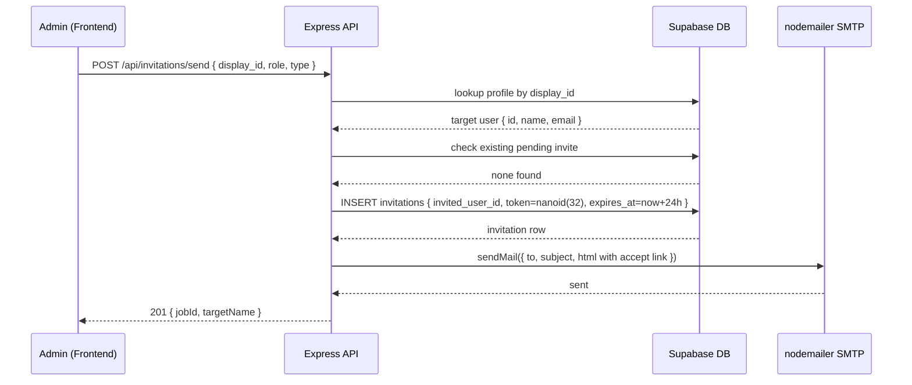
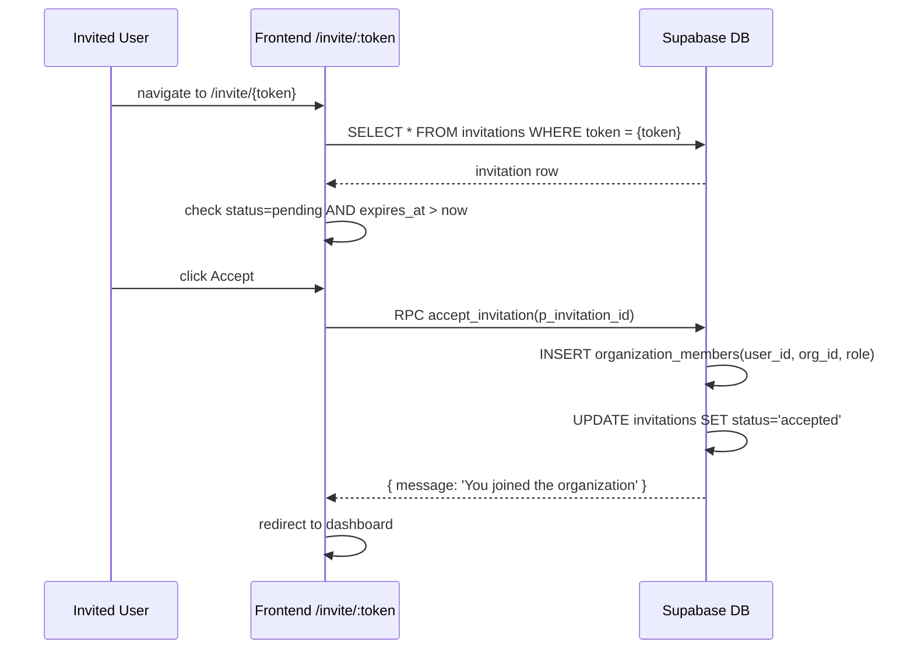
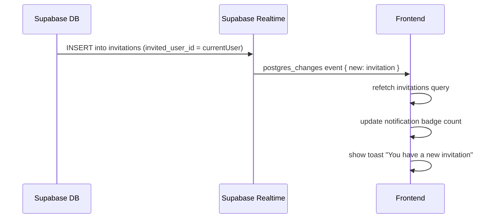
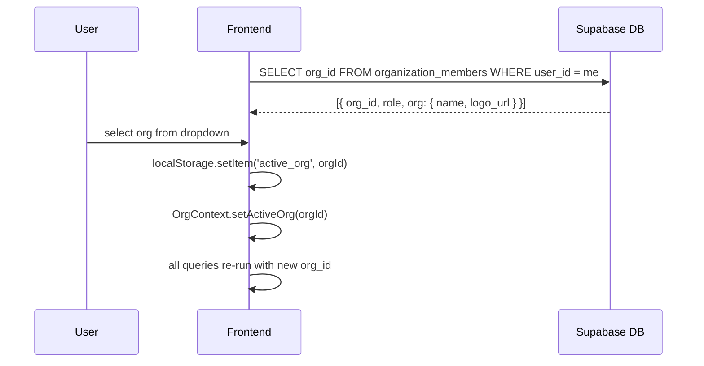

# Design Document: Aurix Invitation System Upgrade

## Overview

This document covers a complete upgrade of the Aurix invitation system — a Business OS for agencies. The upgrade spans database schema hardening, real-time invite delivery, email notifications via nodemailer/SMTP, token-based invite links, expiry enforcement, multi-org switching, advanced RBAC, billing scaffolding, and polished invitation UI. It also addresses a set of known bugs (unknown org, invite not showing, infinite loading, signup race condition, status constraint errors).

The system is built on React + TypeScript + Vite (frontend), Node.js Express (backend on port 25569), Supabase Postgres + Auth + Realtime, and shadcn/ui + Tailwind CSS.

---

## Architecture

```mermaid
graph TD
    subgraph Frontend ["Frontend (React + Vite)"]
        UI[Invitations Page]
        InviteLink[/invite/:token Route]
        OrgSwitcher[Org Switcher Dropdown]
        NotifPanel[Notifications Panel]
        AuthCtx[AuthContext]
        OrgCtx[OrgContext]
        PermHook[usePermissions Hook]
    end

    subgraph Backend ["Backend (Node.js Express :25569)"]
        InviteCtrl[Invitation Controller]
        EmailSvc[Email Service - nodemailer]
        ExpirySvc[Expiry Cron Job]
        RBAC[RBAC Middleware]
    end

    subgraph Supabase ["Supabase"]
        DB[(Postgres DB)]
        Auth[Supabase Auth]
        RT[Realtime]
        RLS[Row Level Security]
    end

    UI -->|REST API| InviteCtrl
    InviteCtrl -->|nanoid token + insert| DB
    InviteCtrl -->|send email| EmailSvc
    EmailSvc -->|SMTP hostinger| ExternalSMTP[smtp.hostinger.com:465]
    InviteLink -->|fetch by token| DB
    InviteLink -->|accept → insert org_member| DB
    RT -->|subscription on invitations| UI
    RT -->|subscription on invitations| NotifPanel
    AuthCtx -->|getSession + fetchProfile| Auth
    OrgCtx -->|fetch organization_members| DB
    OrgSwitcher -->|localStorage active_org| OrgCtx
    PermHook -->|role_permissions table| DB
    ExpirySvc -->|mark expired| DB
```

---

## Sequence Diagrams

### Invite Send Flow



### Invite Accept via Link Flow



### Real-time Invite Notification Flow



### Org Switching Flow



---

## Components and Interfaces

### Component 1: OrgContext

**Purpose**: Manages multi-org membership, active org selection, and global org switching.

**Interface**:
```typescript
interface OrgContextType {
  orgs: OrgMembership[]          // all orgs the user belongs to
  activeOrgId: string | null     // currently selected org
  activeOrg: OrgMembership | null
  setActiveOrg: (orgId: string) => void
  refreshOrgs: () => Promise<void>
}

interface OrgMembership {
  org_id: string
  role: string
  org: { id: string; name: string; logo_url: string | null }
}
```

**Responsibilities**:
- Fetch all `organization_members` rows for the current user on mount
- Persist `active_org` to `localStorage`
- Restore from `localStorage` on reload
- Expose `setActiveOrg` so the navbar dropdown can switch context

---

### Component 2: InviteTokenPage (`/invite/:token`)

**Purpose**: Handles token-based invite acceptance for users who receive an email link.

**Interface**:
```typescript
interface InviteTokenPageProps {} // route-level, no props

// Internal state
interface InviteState {
  invitation: InvitationRow | null
  status: 'loading' | 'valid' | 'expired' | 'invalid' | 'accepted' | 'error'
}
```

**Responsibilities**:
- Fetch invitation by token from Supabase
- Validate: exists, status=pending, expires_at > now
- Show org name, inviter, role badge
- On Accept: call `accept_invitation` RPC, redirect to dashboard
- On Reject: call `reject_invitation` RPC, show confirmation

---

### Component 3: OrgSwitcherDropdown

**Purpose**: Navbar dropdown showing all orgs the user belongs to, with active indicator.

**Interface**:
```typescript
interface OrgSwitcherProps {
  orgs: OrgMembership[]
  activeOrgId: string | null
  onSwitch: (orgId: string) => void
}
```

**Responsibilities**:
- Render org list with logo/avatar and role badge
- Highlight active org
- Call `onSwitch` on selection → updates OrgContext + localStorage

---

### Component 4: Email Service (`backend/src/services/emailService.js`)

**Purpose**: Sends invitation emails via nodemailer with Hostinger SMTP.

**Interface**:
```javascript
// emailService.js
async function sendInvitationEmail({ to, orgName, inviterName, role, acceptLink })
// Returns: { success: boolean, messageId?: string, error?: string }
```

**Responsibilities**:
- Create nodemailer transporter with `smtp.hostinger.com:465`, SSL
- Render HTML email with org name, inviter name, role, accept link
- Handle SMTP errors gracefully (log, don't crash the invite flow)

---

### Component 5: Expiry Cron Job (`backend/src/jobs/expireInvitations.js`)

**Purpose**: Periodically marks expired invitations.

**Interface**:
```javascript
async function expireInvitations()
// UPDATE invitations SET status='expired'
// WHERE status='pending' AND expires_at < now()
```

**Responsibilities**:
- Run on server startup and every hour via `setInterval`
- Use Supabase service-role client to bypass RLS
- Log count of expired rows

---

### Component 6: `useInviteRealtime` Hook

**Purpose**: Subscribes to Supabase Realtime for invitation changes for the current user.

**Interface**:
```typescript
function useInviteRealtime(userId: string | undefined, onNewInvite: () => void): void
```

**Responsibilities**:
- Subscribe to `postgres_changes` on `invitations` table filtered by `invited_user_id=eq.{userId}`
- On INSERT/UPDATE: call `onNewInvite` callback (triggers refetch + badge update)
- Unsubscribe on unmount

---

### Component 7: `hasPermission` Helper

**Purpose**: Client-side permission check utility.

**Interface**:
```typescript
function hasPermission(user: User, permission: string): boolean
// Checks role_permissions table via usePermissions hook
// Used to hide UI elements and guard actions
```

---

## Data Models

### invitations table (final schema)

```sql
CREATE TABLE invitations (
  id              uuid PRIMARY KEY DEFAULT gen_random_uuid(),
  org_id          uuid NOT NULL REFERENCES organizations(id) ON DELETE CASCADE,
  invited_user_id uuid NOT NULL REFERENCES profiles(id) ON DELETE CASCADE,
  invited_by      uuid NOT NULL REFERENCES profiles(id),
  role            text NOT NULL,
  status          text NOT NULL DEFAULT 'pending'
                  CHECK (status IN ('pending', 'accepted', 'rejected', 'expired')),
  token           text UNIQUE NOT NULL,
  expires_at      timestamptz NOT NULL DEFAULT (now() + interval '24 hours'),
  created_at      timestamptz NOT NULL DEFAULT now()
);
```

**Validation Rules**:
- `status` must be one of: `pending`, `accepted`, `rejected`, `expired` (constraint enforced at DB level)
- `token` is a `nanoid(32)` generated by the backend before insert
- `expires_at` defaults to `now() + 24h`; backend also blocks expired invites before DB insert
- `invited_user_id` must be a valid UUID from `profiles.id` (not `display_id`)

---

### organization_members table

```sql
CREATE TABLE organization_members (
  id         uuid PRIMARY KEY DEFAULT gen_random_uuid(),
  user_id    uuid NOT NULL REFERENCES profiles(id) ON DELETE CASCADE,
  org_id     uuid NOT NULL REFERENCES organizations(id) ON DELETE CASCADE,
  role       text NOT NULL DEFAULT 'member',
  created_at timestamptz NOT NULL DEFAULT now(),
  UNIQUE (user_id, org_id)
);
```

---

### roles table

```sql
CREATE TABLE roles (
  id          uuid PRIMARY KEY DEFAULT gen_random_uuid(),
  org_id      uuid NOT NULL REFERENCES organizations(id) ON DELETE CASCADE,
  name        text NOT NULL,
  power_level integer NOT NULL DEFAULT 10,
  permissions jsonb DEFAULT '{}',
  created_at  timestamptz NOT NULL DEFAULT now()
);
```

---

### permissions table

```sql
CREATE TABLE permissions (
  id          uuid PRIMARY KEY DEFAULT gen_random_uuid(),
  key         text UNIQUE NOT NULL,  -- e.g. 'manage_clients', 'invite_users'
  description text
);

-- Seed values:
-- manage_clients, manage_projects, view_invoices, invite_users,
-- manage_roles, manage_users, upload_files, view_file, view_client,
-- view_project, create_project, edit_project, delete_project
```

---

### role_permissions table

```sql
CREATE TABLE role_permissions (
  id             uuid PRIMARY KEY DEFAULT gen_random_uuid(),
  role_id        uuid NOT NULL REFERENCES roles(id) ON DELETE CASCADE,
  permission_key text NOT NULL,
  UNIQUE (role_id, permission_key)
);
```

---

### subscriptions table (billing-ready scaffold)

```sql
CREATE TABLE subscriptions (
  id                     uuid PRIMARY KEY DEFAULT gen_random_uuid(),
  org_id                 uuid NOT NULL REFERENCES organizations(id) ON DELETE CASCADE,
  plan                   text NOT NULL DEFAULT 'free',
  status                 text NOT NULL DEFAULT 'active'
                         CHECK (status IN ('active', 'trialing', 'past_due', 'canceled')),
  stripe_customer_id     text,
  stripe_subscription_id text,
  created_at             timestamptz NOT NULL DEFAULT now(),
  updated_at             timestamptz NOT NULL DEFAULT now()
);
```

---

## Key Functions with Formal Specifications

### `sendInvitation` (backend controller)

```javascript
async function sendInvitation(req, res)
```

**Preconditions**:
- `req.user` is authenticated with `orgId` set
- `req.body.display_id` matches `AURIX-\d{5}` pattern
- `req.body.role` is a non-empty string
- Caller has `invite_users` permission or is admin/manager

**Postconditions**:
- If target not found → 400 "User not found"
- If target already in org → 400 "Already a member"
- If pending invite exists → 400 "Pending invitation already exists"
- If successful → invitation row inserted with `token=nanoid(32)`, `expires_at=now+24h`, `status='pending'`
- Email sent to target user asynchronously (non-blocking)
- Returns 201 with `{ targetName }`

**Loop Invariants**: N/A

---

### `acceptInvitation` (Supabase RPC `accept_invitation`)

```sql
FUNCTION accept_invitation(p_invitation_id uuid) RETURNS jsonb
```

**Preconditions**:
- Invitation exists with `id = p_invitation_id`
- `status = 'pending'`
- `expires_at > now()`
- Caller is the `invited_user_id`

**Postconditions**:
- `organization_members` row inserted: `(user_id=invited_user_id, org_id, role)`
- `invitations.status` updated to `'accepted'`
- Returns `{ message: 'You joined the organization' }`
- If expired → returns `{ error: 'Invitation has expired' }`
- If already accepted → returns `{ error: 'Invitation already processed' }`

---

### `expireInvitations` (cron job)

```javascript
async function expireInvitations(): Promise<{ count: number }>
```

**Preconditions**:
- Supabase service-role client available

**Postconditions**:
- All rows where `status='pending' AND expires_at < now()` updated to `status='expired'`
- Returns count of updated rows
- No rows with `status='pending'` and `expires_at < now()` remain after execution

**Loop Invariants**: N/A (single UPDATE statement)

---

### `useInviteRealtime` (frontend hook)

```typescript
function useInviteRealtime(userId: string | undefined, onNewInvite: () => void): void
```

**Preconditions**:
- `userId` is a valid UUID string
- Supabase client is initialized

**Postconditions**:
- Exactly one Realtime channel subscribed per hook instance
- Channel is removed on component unmount (no memory leaks)
- `onNewInvite` called on every INSERT/UPDATE to `invitations` where `invited_user_id = userId`

---

### `setActiveOrg` (OrgContext)

```typescript
function setActiveOrg(orgId: string): void
```

**Preconditions**:
- `orgId` exists in `orgs` array (user is a member)

**Postconditions**:
- `activeOrgId` state updated
- `localStorage.setItem('active_org', orgId)` called
- All downstream queries using `activeOrgId` will re-run with new value

---

## Algorithmic Pseudocode

### Invite Send Algorithm

```pascal
ALGORITHM sendInvitation(req, res)
INPUT: req.user { id, orgId, role }, req.body { display_id, role_name, type }
OUTPUT: HTTP response

BEGIN
  ASSERT req.user.orgId IS NOT NULL
  ASSERT display_id MATCHES /^AURIX-\d{5}$/

  target ← DB.profiles.findOne(display_id = display_id)
  IF target IS NULL THEN
    RETURN 400 "User not found"
  END IF

  IF target.id = req.user.id THEN
    RETURN 400 "Cannot invite yourself"
  END IF

  existing_member ← DB.organization_members.findOne(user_id=target.id, org_id=req.user.orgId)
  IF existing_member IS NOT NULL THEN
    RETURN 400 "User is already a member"
  END IF

  pending ← DB.invitations.findOne(invited_user_id=target.id, org_id=req.user.orgId, status='pending')
  IF pending IS NOT NULL THEN
    RETURN 400 "Pending invitation already exists"
  END IF

  token ← nanoid(32)
  expires_at ← now() + 24h

  invitation ← DB.invitations.insert({
    org_id: req.user.orgId,
    invited_user_id: target.id,
    invited_by: req.user.id,
    role: role_name,
    status: 'pending',
    token: token,
    expires_at: expires_at
  })

  // Non-blocking email
  emailService.sendInvitationEmail({
    to: target.email,
    orgName: org.name,
    inviterName: req.user.name,
    role: role_name,
    acceptLink: APP_URL + '/invite/' + token
  }).catch(err => logger.error('Email failed', err))

  RETURN 201 { targetName: target.name }
END
```

### Token Accept Algorithm

```pascal
ALGORITHM handleInviteToken(token)
INPUT: token (string from URL param)
OUTPUT: UI state transition

BEGIN
  invitation ← DB.invitations.findOne(token = token)

  IF invitation IS NULL THEN
    SET state ← 'invalid'
    RETURN
  END IF

  IF invitation.status ≠ 'pending' THEN
    SET state ← invitation.status  // 'accepted', 'rejected', 'expired'
    RETURN
  END IF

  IF invitation.expires_at < now() THEN
    DB.invitations.update(id=invitation.id, status='expired')
    SET state ← 'expired'
    RETURN
  END IF

  SET state ← 'valid'
  SET invitation ← invitation

  // On user click Accept:
  result ← DB.rpc('accept_invitation', { p_invitation_id: invitation.id })
  IF result.error THEN
    SHOW error toast
  ELSE
    REDIRECT to dashboard
  END IF
END
```

### Org Switching Algorithm

```pascal
ALGORITHM initOrgContext(userId)
INPUT: userId (UUID)
OUTPUT: orgs[], activeOrgId

BEGIN
  rows ← DB.organization_members
    .select('org_id, role, organizations(id, name, logo_url)')
    .where(user_id = userId)

  orgs ← rows.map(r => { org_id: r.org_id, role: r.role, org: r.organizations })

  storedOrgId ← localStorage.getItem('active_org')

  IF storedOrgId IS NOT NULL AND orgs.some(o => o.org_id = storedOrgId) THEN
    activeOrgId ← storedOrgId
  ELSE IF orgs.length > 0 THEN
    activeOrgId ← orgs[0].org_id
    localStorage.setItem('active_org', activeOrgId)
  ELSE
    activeOrgId ← NULL
  END IF

  RETURN { orgs, activeOrgId }
END
```

### Expiry Cron Algorithm

```pascal
ALGORITHM expireInvitations()
INPUT: none
OUTPUT: { count: number }

BEGIN
  result ← DB.invitations
    .update({ status: 'expired' })
    .where(status = 'pending' AND expires_at < now())

  count ← result.count
  logger.info('Expired invitations', { count })

  RETURN { count }
END
```

---

## Error Handling

### Error Scenario 1: "Unknown Organization"

**Condition**: Invitation loaded but `org_id` not joined to `organizations` table.
**Response**: Always JOIN `organizations` table when fetching invitations. Use `organizations!inner` in Supabase select or explicit join.
**Recovery**: If org row missing (deleted), show "Organization no longer exists" and mark invite expired.

---

### Error Scenario 2: Invite Not Showing (invited_user_id mismatch)

**Condition**: `invited_user_id` stored as display_id string instead of UUID.
**Response**: Backend must resolve `display_id → profiles.id` (UUID) before inserting invitation. Frontend queries by `invited_user_id = user.id` (UUID).
**Recovery**: Migration script to fix existing rows where `invited_user_id` is not a valid UUID.

---

### Error Scenario 3: Infinite Loading (auth state blocking)

**Condition**: `AuthContext` waits for full profile fetch before setting `loading=false`.
**Response**: Set `loading=false` immediately after `getSession()` resolves. Enrich profile in background. Use `minimalUser()` as placeholder.
**Recovery**: 4-second failsafe `setTimeout` forces `loading=false` regardless.

---

### Error Scenario 4: Signup Race Condition

**Condition**: `onAuthStateChange` fires before profile row is created in DB.
**Response**: Use retry mechanism in `finalizeAccountType` — retry up to 5 times with 500ms delay before giving up.
**Recovery**: If all retries fail, log error and continue (user can refresh).

---

### Error Scenario 5: Status Constraint Violation

**Condition**: Code attempts to set `status='cancelled'` which is not in the CHECK constraint.
**Response**: Only use allowed values: `pending`, `accepted`, `rejected`, `expired`. Remove `cancelled` from all frontend STATUS_STYLES and backend logic.
**Recovery**: DB constraint rejects invalid values; backend returns 400 with clear message.

---

### Error Scenario 6: SMTP Failure

**Condition**: Hostinger SMTP unreachable or credentials invalid.
**Response**: Email send is non-blocking — invitation is still created in DB. Error is logged.
**Recovery**: Admin can resend invitation from the Sent tab (creates new token + email).

---

## Testing Strategy

### Unit Testing Approach

- Test `sendInvitation` controller with mocked Supabase and emailService
- Test `expireInvitations` cron with mocked DB returning N rows
- Test `useInviteRealtime` hook with mocked Supabase channel
- Test `OrgContext` init logic: localStorage restore, fallback to first org
- Test `hasPermission` helper with various role/permission combinations

### Property-Based Testing Approach

**Property Test Library**: fast-check (already in ecosystem via Vite)

- Property: For any valid `token` string of length 32, `fetchInvitationByToken` returns exactly one row or null — never throws
- Property: For any `expires_at` in the past, `handleInviteToken` always resolves to `'expired'` state
- Property: `setActiveOrg(orgId)` where `orgId ∈ orgs` always results in `activeOrgId === orgId` and `localStorage` updated

### Integration Testing Approach

- End-to-end: Admin sends invite → email sent → user navigates to `/invite/:token` → accepts → appears in `organization_members`
- Realtime: Insert invitation row → frontend badge increments within 2 seconds
- Org switching: User with 2 orgs switches → all queries re-run with new `org_id`

---

## Performance Considerations

- Realtime subscription is scoped to `invited_user_id = eq.{userId}` — not a full table scan
- `organization_members` query is indexed on `user_id`
- `invitations` token lookup uses UNIQUE index (O(1))
- Expiry cron runs hourly — not on every request
- Email sending is async/non-blocking — invite API responds in <200ms regardless of SMTP latency
- `OrgContext` fetches org list once on mount, not on every render

---

## Security Considerations

- `token` is `nanoid(32)` — 32 chars from 64-char alphabet = ~192 bits of entropy (brute-force infeasible)
- `expires_at` enforced both in frontend (UI check) and backend RPC (DB-level check)
- RLS policies on `invitations`: users can only read rows where `invited_user_id = auth.uid()` or `invited_by = auth.uid()`
- `accept_invitation` RPC verifies caller is the `invited_user_id` before inserting into `organization_members`
- SMTP credentials stored in `backend/.env` — never exposed to frontend
- `APP_URL` in accept link comes from server env var — not user-controlled
- `role` assigned on accept comes from the invitation row — not from user input at accept time

---

## Dependencies

**New backend dependencies**:
- `nodemailer` — SMTP email sending
- `nanoid` — cryptographically secure token generation

**New frontend dependencies**:
- None (uses existing Supabase Realtime client, TanStack Query, shadcn/ui)

**New Supabase tables**:
- `organization_members` (may already exist — verify and migrate if needed)
- `permissions` (seed with standard permission keys)
- `subscriptions` (billing scaffold)

**Existing infrastructure used**:
- Supabase Realtime (already configured in client)
- BullMQ queue + worker (invitation worker already exists)
- `role_permissions` table (already exists, used by `usePermissions`)
- `notifications` table (already exists, used by `NotificationsPanel`)
