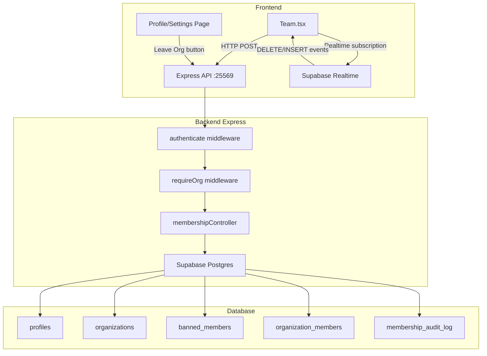

# Design Document: Org Membership Management

## Overview

This feature adds full membership lifecycle management to the Aurix platform: voluntary leave, admin-initiated remove, ban (with persistent registry), and unban. All enforcement is server-side via four new Express endpoints on the existing backend (port 25569). The frontend (`Team.tsx`) gains Remove/Ban/Unban actions and a Leave Org button in a Danger Zone section. Real-time membership changes are pushed to all connected clients via Supabase Realtime subscriptions on the `organization_members` table.

The existing `profiles` table tracks `org_id` and `power_level`. A new `banned_members` table serves as the Ban Registry. The role hierarchy is enforced numerically: `superadmin=100, admin=90, manager=70, member=50, client=10`.

---

## Architecture



**Data flow for a Remove action:**
1. Admin clicks Remove on Team.tsx → confirmation dialog
2. Frontend calls `POST /api/members/remove` with `{ target_user_id }`
3. `authenticate` verifies JWT, `requireOrg` confirms requester has an org
4. `membershipController.removeMember` checks power level hierarchy
5. Deletes row from `organization_members`, nulls `profiles.org_id`
6. Supabase Realtime broadcasts DELETE event on `organization_members`
7. All connected Team.tsx clients receive event and update their member list
8. If the removed user is the current session user, they are redirected to login

---

## Components and Interfaces

### Backend: `membershipController.js`

New controller at `backend/src/controllers/membershipController.js`.

```js
// Leave own organization
export async function leaveOrganization(req, res)

// Remove a target member (admin/superadmin only)
export async function removeMember(req, res)

// Ban a target member (admin/superadmin only)
export async function banMember(req, res)

// Unban a previously banned user (admin/superadmin only)
export async function unbanMember(req, res)

// List banned members for the requester's org
export async function getBannedMembers(req, res)
```

### Backend: New Routes in `routes/index.js`

```js
router.post('/members/leave',   authenticate, requireOrg, writeLimiter, leaveOrganization);
router.post('/members/remove',  authenticate, requireOrg, writeLimiter, requireRole('admin','super_admin'), removeMember);
router.post('/members/ban',     authenticate, requireOrg, writeLimiter, requireRole('admin','super_admin'), banMember);
router.post('/members/unban',   authenticate, requireOrg, writeLimiter, requireRole('admin','super_admin'), unbanMember);
router.get ('/members/banned',  authenticate, requireOrg, requireRole('admin','super_admin'), getBannedMembers);
```

### Frontend: `useMembership` hook

New hook at `src/hooks/use-membership.ts` wrapping all membership mutations and the banned members query.

```ts
export function useLeaveOrganization(): UseMutationResult
export function useRemoveMember(): UseMutationResult
export function useBanMember(): UseMutationResult
export function useUnbanMember(): UseMutationResult
export function useBannedMembers(): UseQueryResult<BannedMember[]>
export function useOrgMembersRealtime(orgId: string, onSelfRemoved: () => void): void
```

### Frontend: `Team.tsx` additions

- `RemoveMemberDialog` — confirmation AlertDialog for remove
- `BanMemberDialog` — confirmation AlertDialog for ban
- `BannedMembersTab` — tab/section listing banned members with Unban button
- `DangerZone` — section at bottom of page with Leave Organization button + confirmation

### Shared: Power Level utility

```ts
// src/lib/powerLevel.ts
export const ROLE_POWER: Record<string, number> = {
  superadmin: 100,
  super_admin: 100,
  admin: 90,
  manager: 70,
  member: 50,
  client: 10,
};

export function getPowerLevel(role: string): number
export function canActOn(actorRole: string, targetRole: string): boolean
```

---

## Data Models

### New Table: `banned_members`

```sql
CREATE TABLE banned_members (
  id         UUID PRIMARY KEY DEFAULT gen_random_uuid(),
  user_id    UUID NOT NULL REFERENCES profiles(id) ON DELETE CASCADE,
  org_id     UUID NOT NULL REFERENCES organizations(id) ON DELETE CASCADE,
  banned_by  UUID NOT NULL REFERENCES profiles(id),
  reason     TEXT,
  created_at TIMESTAMPTZ NOT NULL DEFAULT now(),
  UNIQUE (user_id, org_id)
);

CREATE INDEX idx_banned_members_org ON banned_members(org_id);
CREATE INDEX idx_banned_members_user ON banned_members(user_id);
```

The `UNIQUE (user_id, org_id)` constraint prevents duplicate ban records and makes upsert-safe.

### New Table: `membership_audit_log`

```sql
CREATE TABLE membership_audit_log (
  id           UUID PRIMARY KEY DEFAULT gen_random_uuid(),
  org_id       UUID NOT NULL,
  action       TEXT NOT NULL,  -- 'leave' | 'remove' | 'ban' | 'unban'
  requester_id UUID NOT NULL,
  target_id    UUID NOT NULL,
  created_at   TIMESTAMPTZ NOT NULL DEFAULT now()
);

CREATE INDEX idx_audit_log_org ON membership_audit_log(org_id);
```

### Existing Table Changes

`profiles` — no schema change needed. `org_id` is already nullable; setting it to `null` effectively removes the user from the org.

`organizations` — needs a `status` column if not present:
```sql
ALTER TABLE organizations ADD COLUMN IF NOT EXISTS status TEXT NOT NULL DEFAULT 'active';
```

### TypeScript Types

```ts
// src/types/membership.ts
export interface BannedMember {
  id: string;
  userId: string;
  orgId: string;
  bannedBy: string;
  bannedByName?: string;
  reason?: string;
  createdAt: string;
  // joined from profiles
  name?: string;
  email?: string;
}

export interface MembershipAction {
  targetUserId: string;
  reason?: string;
}
```

---

## Low-Level Design

### `leaveOrganization(req, res)`

```
1. requester = req.user  (orgId, id, role, powerLevel)
2. Query organization_members WHERE user_id = requester.id AND org_id = requester.orgId
   → if not found: 404
3. Count superadmins in org WHERE role = 'superadmin' AND org_id = requester.orgId
   → if requester.role === 'superadmin' AND count === 1:
       return 400 "You are the only owner. Transfer ownership before leaving."
4. BEGIN transaction:
   a. DELETE FROM organization_members WHERE user_id = requester.id AND org_id = requester.orgId
   b. UPDATE profiles SET org_id = null WHERE id = requester.id
   c. Count remaining members in org
      → if count === 0: UPDATE organizations SET status = 'inactive' WHERE id = requester.orgId
   d. INSERT INTO membership_audit_log (org_id, action, requester_id, target_id)
5. COMMIT
6. return 200 { success: true }
```

### `removeMember(req, res)`

```
Input: { target_user_id: UUID }

1. requester = req.user
2. if target_user_id === requester.id: return 400 "Cannot remove yourself"
3. Fetch target profile: SELECT id, org_id, power_level, role FROM profiles WHERE id = target_user_id
   → if not found: 404
   → if target.org_id !== requester.orgId: 403 "Target is not in your organization"
4. if target.power_level >= requester.powerLevel: 403 "Insufficient authority"
5. BEGIN transaction:
   a. DELETE FROM organization_members WHERE user_id = target_user_id AND org_id = requester.orgId
   b. UPDATE profiles SET org_id = null WHERE id = target_user_id
   c. Count remaining members → if 0: mark org inactive
   d. INSERT INTO membership_audit_log
6. COMMIT
7. return 200 { success: true }
```

### `banMember(req, res)`

```
Input: { target_user_id: UUID, reason?: string }

1. requester = req.user
2. if target_user_id === requester.id: return 400
3. Fetch target profile (same as removeMember steps 3-4)
4. Check existing ban: SELECT id FROM banned_members WHERE user_id = target_user_id AND org_id = requester.orgId
   → if exists: return 400 "User is already banned"
5. BEGIN transaction:
   a. INSERT INTO banned_members (user_id, org_id, banned_by, reason)
   b. DELETE FROM organization_members WHERE user_id = target_user_id AND org_id = requester.orgId
   c. UPDATE profiles SET org_id = null WHERE id = target_user_id
   d. Count remaining members → if 0: mark org inactive
   e. INSERT INTO membership_audit_log (action = 'ban')
6. COMMIT
7. return 200 { success: true }
```

### `unbanMember(req, res)`

```
Input: { target_user_id: UUID }

1. requester = req.user
2. SELECT id FROM banned_members WHERE user_id = target_user_id AND org_id = requester.orgId
   → if not found: 404 "No ban record found for this user in your organization"
3. DELETE FROM banned_members WHERE user_id = target_user_id AND org_id = requester.orgId
4. INSERT INTO membership_audit_log (action = 'unban')
5. return 200 { success: true }
```

### Ban Check in Invitation Flow

In `invitationController.respondToInvitation`, before calling `accept_invitation` RPC:

```js
// Check ban registry
const { data: ban } = await supabase
  .from('banned_members')
  .select('id')
  .eq('user_id', userId)
  .eq('org_id', invitationOrgId)
  .maybeSingle();

if (ban) return forbidden(res, 'You are banned from this organization.');
```

### Frontend: `useOrgMembersRealtime`

```ts
export function useOrgMembersRealtime(
  orgId: string,
  currentUserId: string,
  onSelfRemoved: () => void
) {
  const queryClient = useQueryClient();

  useEffect(() => {
    const channel = supabase
      .channel(`org-members:${orgId}`)
      .on('postgres_changes', {
        event: '*',
        schema: 'public',
        table: 'organization_members',
        filter: `org_id=eq.${orgId}`,
      }, (payload) => {
        // If current user was removed/banned
        if (
          payload.eventType === 'DELETE' &&
          payload.old?.user_id === currentUserId
        ) {
          onSelfRemoved();
          return;
        }
        // Invalidate team query to refresh list
        queryClient.invalidateQueries({ queryKey: ['team'] });
      })
      .subscribe();

    return () => { supabase.removeChannel(channel); };
  }, [orgId, currentUserId]);
}
```

### Power Level Enforcement (Backend)

The `authenticate` middleware already fetches `power_level` from `profiles` and attaches it as `req.user.powerLevel`. The controller compares:

```js
const ROLE_POWER = {
  super_admin: 100,
  admin: 90,
  manager: 70,
  member: 50,
  client: 10,
};

function getPowerLevel(role) {
  return ROLE_POWER[role] ?? 10;
}
```

Target's `power_level` is fetched fresh from the DB on every request — never trusted from the client.

---

## Correctness Properties

*A property is a characteristic or behavior that should hold true across all valid executions of a system — essentially, a formal statement about what the system should do. Properties serve as the bridge between human-readable specifications and machine-verifiable correctness guarantees.*

### Property 1: Leave removes membership

*For any* authenticated org member who is not the sole superadmin, calling `leaveOrganization` should result in that user no longer having an `org_id` in `profiles` and no row in `organization_members` for that org.

**Validates: Requirements 1.1**

---

### Property 2: Sole owner cannot leave

*For any* organization where the requester is the only member with `role = 'superadmin'`, calling `leaveOrganization` SHALL be rejected with a 400 error containing the ownership transfer message.

**Validates: Requirements 1.2, 8.1**

---

### Property 3: Remove enforces power level hierarchy

*For any* requester with power level P_r and target with power level P_t in the same org, `removeMember` succeeds if and only if P_r > P_t. When P_t >= P_r, the response is 403.

**Validates: Requirements 2.1, 2.2, 5.2**

---

### Property 4: Ban creates registry record and removes membership

*For any* valid ban request (P_r > P_t, same org, no existing ban), after `banMember` completes: a record exists in `banned_members` for `(user_id, org_id)` AND the target has no row in `organization_members` for that org.

**Validates: Requirements 3.3**

---

### Property 5: Ban check is org-scoped

*For any* user banned in organization A, they should still be permitted to join organization B. The ban check uses both `user_id` AND `org_id` as the lookup key.

**Validates: Requirements 3.4, 3.5, 9.5**

---

### Property 6: Banned user cannot accept invitation

*For any* user with a ban record in `banned_members` for org X, attempting to accept an invitation to org X SHALL be rejected with the "You are banned from this organization" message.

**Validates: Requirements 3.4, 8.3**

---

### Property 7: Unban round-trip removes ban record

*For any* user who has been banned from an org, calling `unbanMember` for that user in that org should result in no ban record existing in `banned_members` for `(user_id, org_id)`.

**Validates: Requirements 4.3**

---

### Property 8: Unban of non-banned user returns 404

*For any* unban request where no matching ban record exists in `banned_members` for `(user_id, org_id)`, the response SHALL be 404.

**Validates: Requirements 4.1, 4.2**

---

### Property 9: Action visibility matches power level

*For any* member list rendered on Team.tsx, the Remove and Ban actions SHALL be visible for a given member if and only if that member's power level is strictly less than the current user's power level.

**Validates: Requirements 2.7, 3.7, 6.3**

---

### Property 10: Last-member org becomes inactive

*For any* organization with exactly one member, after that member leaves or is removed, the organization's `status` SHALL be set to `'inactive'`.

**Validates: Requirements 8.2**

---

### Property 11: Cross-org actions are rejected

*For any* remove or ban request where the target's `org_id` differs from the requester's `org_id`, the response SHALL be 403.

**Validates: Requirements 9.4**

---

## Error Handling

| Scenario | HTTP Status | Message |
|---|---|---|
| Missing/invalid JWT | 401 | "Missing or invalid Authorization header" |
| User has no org | 403 | "You must belong to an organization" |
| Non-admin calling remove/ban/unban | 403 | "Required role: admin or super_admin" |
| Self-remove attempt | 400 | "Cannot remove yourself" |
| Target not in same org | 403 | "Target is not in your organization" |
| Insufficient power level | 403 | "Insufficient authority to act on this member" |
| Sole owner trying to leave | 400 | "You are the only owner. Transfer ownership before leaving." |
| Target not found | 404 | "User not found" |
| Target already banned | 400 | "User is already banned from this organization" |
| Unban with no ban record | 404 | "No ban record found for this user in your organization" |
| Banned user accepting invite | 403 | "You are banned from this organization." |
| DB error | 500 | Descriptive error message |

All errors are returned in the existing `{ success: false, error: string }` format from `utils/response.js`.

Frontend errors are surfaced via the existing `useToast` hook with `variant: "destructive"`.

---

## Testing Strategy

### Unit Tests (Vitest)

Focus on pure logic and controller behavior with mocked Supabase client:

- `getPowerLevel(role)` returns correct values for all roles
- `canActOn(actorRole, targetRole)` returns correct boolean for all combinations
- `leaveOrganization` — sole owner rejection, successful leave, DB error handling
- `removeMember` — self-remove rejection, cross-org rejection, hierarchy enforcement, successful remove
- `banMember` — duplicate ban rejection, hierarchy enforcement, successful ban (both registry insert and member removal)
- `unbanMember` — missing ban record 404, successful unban
- Ban check in invitation flow — banned user rejected, non-banned user passes

### Property-Based Tests (fast-check)

Using [fast-check](https://github.com/dubzzz/fast-check) with minimum 100 iterations per property.

Each test is tagged: `// Feature: org-membership-management, Property N: <property_text>`

- **Property 1**: Generate random (userId, orgId) pairs, call leave, verify org_id is null
- **Property 2**: Generate orgs with exactly one superadmin, call leave as that user, verify 400
- **Property 3**: Generate (P_r, P_t) pairs, call remove, verify success iff P_r > P_t
- **Property 4**: Generate valid ban inputs, call ban, verify banned_members record exists AND org membership removed
- **Property 5**: Generate user banned in org A, attempt join org B, verify not blocked
- **Property 6**: Generate banned user + invitation to same org, verify acceptance rejected
- **Property 7**: Generate (userId, orgId) with ban record, call unban, verify no ban record remains
- **Property 8**: Generate unban requests with no matching ban record, verify 404
- **Property 9**: Generate member lists with varying power levels, render Team.tsx, verify Remove/Ban visibility
- **Property 10**: Generate org with one member, remove that member, verify org.status = 'inactive'
- **Property 11**: Generate cross-org remove/ban requests, verify 403

### Integration Tests

- Supabase Realtime subscription established on `organization_members` table
- DELETE event on `organization_members` triggers `queryClient.invalidateQueries`
- Self-removal event triggers `onSelfRemoved` callback
- Ban check in invitation acceptance flow (end-to-end with test DB)

### Frontend Component Tests (Vitest + Testing Library)

- Remove/Ban/Unban buttons render only for eligible members
- Confirmation dialogs appear before destructive actions
- Leave Organization button present in Danger Zone for all members
- Loading state disables buttons during pending mutations
- Banned Members tab renders with unban controls for admins
