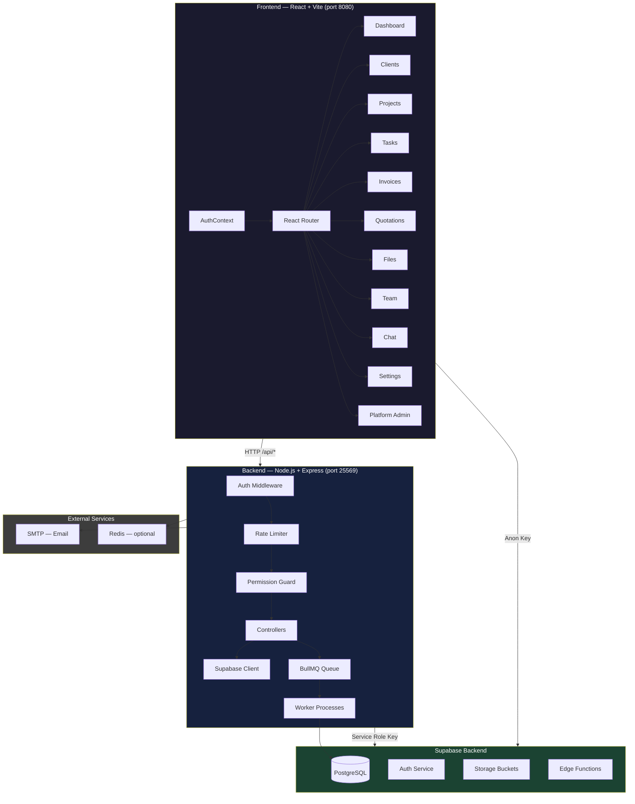
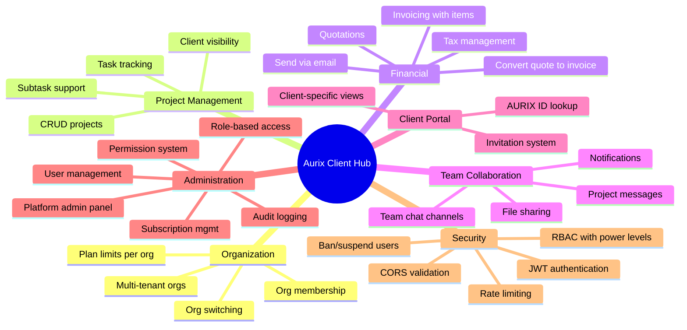
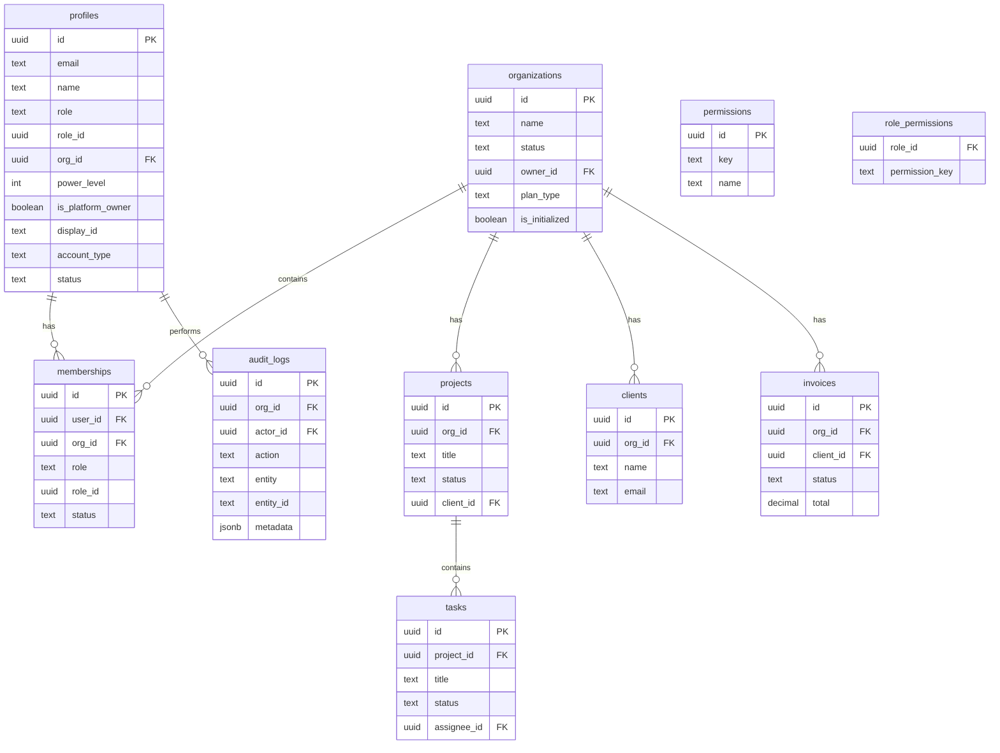
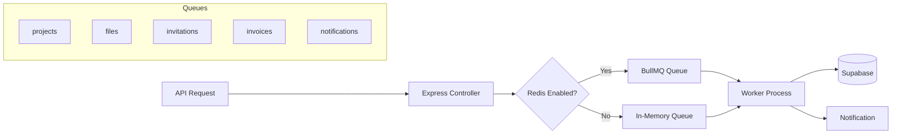

# Aurix Client Hub

Aurix Client Hub is a production-ready SaaS management platform built for agencies and service businesses. It provides organization management, client portal, project tracking, invoicing, quotations, team collaboration, file storage, role-based access control, and a platform admin panel — all in one application.

## Architecture



## Tech Stack

| Layer | Technology |
|-------|-----------|
| **Frontend** | React 18, TypeScript, Vite, Tailwind CSS, shadcn/ui |
| **Backend** | Node.js, Express, ESM modules |
| **Database** | Supabase (PostgreSQL) |
| **Auth** | Supabase Auth (JWT) + service role |
| **Queue** | BullMQ (Redis) with in-memory fallback |
| **Email** | Nodemailer (SMTP) |
| **Validation** | Zod |
| **Testing** | Vitest (unit), Playwright (E2E) |
| **Deployment** | PM2, Nginx reverse proxy, Vercel (frontend) |

## Features



## Directory Structure

```
aurix-client-hub/
├── src/                          # Frontend application
│   ├── components/               # UI components (shadcn + custom)
│   │   └── ui/                   # shadcn/ui primitives
│   ├── contexts/                 # AuthContext (session management)
│   ├── hooks/                    # Custom React hooks
│   ├── integrations/supabase/    # Supabase client + types
│   ├── lib/                      # Utility functions
│   ├── pages/                    # Route pages
│   │   ├── platform/             # Platform admin sub-pages
│   │   ├── Dashboard.tsx
│   │   ├── Clients.tsx
│   │   ├── Projects.tsx
│   │   ├── Tasks.tsx
│   │   ├── Invoices.tsx
│   │   ├── Quotations.tsx
│   │   ├── Files.tsx
│   │   ├── Team.tsx
│   │   ├── Chat.tsx
│   │   ├── Roles.tsx
│   │   ├── Settings.tsx
│   │   ├── Invitations.tsx
│   │   ├── Onboarding.tsx
│   │   └── Platform.tsx
│   ├── App.tsx                   # Root with routing
│   └── main.tsx                  # Entry point
├── backend/                      # Backend API server
│   ├── src/
│   │   ├── config/               # Supabase, Redis, access control
│   │   ├── controllers/          # Route handlers
│   │   ├── middlewares/          # Auth, rate limiting, validation
│   │   ├── queue/                # BullMQ queue + worker
│   │   ├── routes/               # Express router
│   │   ├── services/             # Mail, permissions, plan limits
│   │   └── utils/                # Logger, response helpers
│   ├── nginx.conf                # Production Nginx config
│   └── ecosystem.config.cjs      # PM2 config
├── supabase/
│   ├── functions/                # Edge functions
│   │   ├── create-client/
│   │   └── create-user/
│   └── migrations/               # Database migrations
├── public/
│   └── robots.txt
└── config files                  # vite, tailwind, eslint, tsconfig etc.
```

## Data Model



## Role-Based Access Control

The system uses a **4-tier canonical role model** with power levels:

| Role | Power | Display | Description |
|------|-------|---------|-------------|
| `super_admin` | 100 | Owner | Full access, platform owner |
| `admin` | 90 | Admin | Org-wide management |
| `member` | 50 | Member | Team member (developer, support, manager) |
| `client` | 10 | Client | External user, limited visibility |

**Access matrix** (frontend routes):

```
              Owner  Admin  Member  Client
Dashboard      ✅     ✅     ✅      ✅
Clients        ✅     ✅     ✅      ❌
Projects       ✅     ✅     ✅      ✅*
Tasks          ✅     ✅     ✅      ✅*
Invoices       ✅     ✅     ✅      ✅
Quotations     ✅     ✅     ✅      ✅
Files          ✅     ✅     ✅      ✅
Team           ✅     ✅     ✅      ❌
Roles          ✅     ✅     ❌      ❌
Settings       ✅     ✅     ❌      ❌
Audit Logs     ✅     ✅     ❌      ❌
Chat           ✅     ✅     ✅      ✅
```

*Clients see only their own projects/tasks, filtered in controllers.

Backend additionally enforces **fine-grained permissions** via `role_permissions` table (26 permissions including `create_project`, `manage_clients`, `upload_files`, `manage_roles`, etc.).

## API Endpoints

### Core Resources

| Method | Path | Auth | Description |
|--------|------|------|-------------|
| `GET` | `/api/profile` | JWT | Get user profile |
| `PATCH` | `/api/profile` | JWT | Update profile |
| `GET` | `/api/organizations` | Org | Get current org |
| `PATCH` | `/api/organizations` | Org | Update org |
| `GET` | `/api/organizations/mine` | JWT | List user's orgs |
| `POST` | `/api/organizations/switch` | JWT | Switch active org |
| `GET` | `/api/projects` | Org | List projects |
| `POST` | `/api/projects` | Permission | Create project |
| `PATCH` | `/api/projects/:id` | Permission | Update project |
| `DELETE` | `/api/projects/:id` | Permission | Delete project |
| `GET` | `/api/tasks` | Org | List tasks |
| `POST` | `/api/tasks` | Org | Create task |
| `PATCH` | `/api/tasks/:id` | Org | Update task |
| `DELETE` | `/api/tasks/:id` | Org | Delete task |
| `GET` | `/api/messages` | Org | Get project messages |
| `POST` | `/api/messages` | Org | Send message |
| `GET` | `/api/clients` | Org | List clients |
| `POST` | `/api/clients` | Permission | Create client |
| `PATCH` | `/api/clients/:id` | Permission | Update client |
| `DELETE` | `/api/clients/:id` | Permission | Delete client |
| `GET` | `/api/files` | Org | List files |
| `POST` | `/api/files/upload` | Permission | Register file |
| `DELETE` | `/api/files/:id` | Org | Delete file |
| `GET` | `/api/invoices` | Org | List invoices |
| `POST` | `/api/invoices` | Org | Create invoice |
| `PATCH` | `/api/invoices/:id` | Org | Update invoice |
| `DELETE` | `/api/invoices/:id` | Org | Delete invoice |
| `POST` | `/api/invoices/:id/send` | Org | Email invoice |
| `GET` | `/api/quotations` | Org | List quotations |
| `POST` | `/api/quotations` | Org | Create quotation |
| `PATCH` | `/api/quotations/:id` | Org | Update quotation |
| `POST` | `/api/quotations/:id/convert` | Org | Convert to invoice |
| `DELETE` | `/api/quotations/:id` | Org | Delete quotation |
| `POST` | `/api/quotations/:id/send` | Org | Email quotation |
| `GET` | `/api/taxes` | Org | List taxes |
| `POST` | `/api/taxes` | Org | Create tax |
| `DELETE` | `/api/taxes/:id` | Org | Delete tax |

### Team & Membership

| Method | Path | Auth | Description |
|--------|------|------|-------------|
| `GET` | `/api/users` | Permission | List team members |
| `PATCH` | `/api/users/:id` | Permission | Update user |
| `DELETE` | `/api/users/:id` | Permission | Remove user |
| `POST` | `/api/users/:id/role` | Admin | Change user role |
| `GET` | `/api/roles` | Permission | List roles |
| `POST` | `/api/roles` | Permission | Create role |
| `PATCH` | `/api/roles/:id` | Permission | Update role |
| `DELETE` | `/api/roles/:id` | Admin | Delete role |
| `GET` | `/api/invitations` | JWT | My invitations |
| `POST` | `/api/invitations/send` | Org | Send invitation |
| `POST` | `/api/invitations/respond` | JWT | Accept/reject |
| `POST` | `/api/members/leave` | Org | Leave org |
| `POST` | `/api/members/remove` | Admin | Remove member |
| `POST` | `/api/members/ban` | Admin | Ban member |
| `POST` | `/api/members/unban` | Admin | Unban member |

### Chat & Notifications

| Method | Path | Auth | Description |
|--------|------|------|-------------|
| `GET` | `/api/chat/channels` | Org | List channels |
| `POST` | `/api/chat/channels` | Admin | Create channel |
| `DELETE` | `/api/chat/channels/:id` | Admin | Delete channel |
| `GET` | `/api/chat/channels/:id/messages` | Org | Get messages |
| `POST` | `/api/chat/messages` | Org | Send message |
| `GET` | `/api/notifications` | JWT | List notifications |
| `PATCH` | `/api/notifications/:id/read` | JWT | Mark read |
| `POST` | `/api/notifications/read-all` | JWT | Mark all read |

### Platform Admin

| Method | Path | Description |
|--------|------|-------------|
| `GET` | `/api/platform/stats` | Platform statistics |
| `GET` | `/api/platform/organizations` | All organizations |
| `POST` | `/api/platform/organizations/status` | Set org status |
| `GET` | `/api/platform/users` | All users |
| `PATCH` | `/api/platform/users/:id/status` | Update user status |
| `GET` | `/api/platform/subscriptions` | Subscriptions |
| `PATCH` | `/api/platform/subscriptions/:id` | Update subscription |
| `GET` | `/api/platform/feature-flags` | Feature flags |
| `PATCH` | `/api/platform/feature-flags/:id` | Update flag |
| `GET` | `/api/platform/team` | Platform team |
| `POST` | `/api/platform/team` | Add member |
| `DELETE` | `/api/platform/team/:id` | Remove member |
| `GET` | `/api/platform/audit-logs` | Platform audit logs |
| `GET` | `/api/platform/support` | Support conversations |

### Other

| Method | Path | Description |
|--------|------|-------------|
| `GET` | `/health` | Health check |
| `GET` | `/api/ping` | Diagnostic endpoint |
| `POST` | `/api/onboarding/provision` | Provision new org |
| `POST` | `/api/upgrade` | Upgrade account (atomic) |
| `POST` | `/api/storage/upload` | Upload file |
| `GET` | `/api/storage/public-url` | Get public URL |
| `POST` | `/api/storage/signed-url` | Create signed URL |
| `POST` | `/api/storage/delete` | Delete storage file |

## Queue Architecture



The queue system uses **BullMQ** when Redis is available, with an automatic **in-memory fallback** for environments without Redis. This means the platform works out of the box on any VPS without additional infrastructure.

## Getting Started

### Prerequisites

- Node.js 18+
- npm or pnpm
- A Supabase project (free tier works)

### 1. Frontend Setup

```bash
# Copy environment template
cp .env.example .env

# Edit .env with your values
VITE_SUPABASE_URL=https://your-project.supabase.co
VITE_SUPABASE_ANON_KEY=your_anon_key_here
VITE_API_URL=http://localhost:25569

# Install & start
npm install
npm run dev
```

### 2. Backend Setup

```bash
cd backend

# Copy environment template
cp .env.example .env

# Edit .env with your values
SUPABASE_URL=https://your-project.supabase.co
SUPABASE_SERVICE_ROLE_KEY=your_service_role_key
JWT_SECRET=your_jwt_secret
ALLOWED_DOMAINS=localhost:8080,localhost:5173
APP_URL=http://localhost:8080

# Optionally configure SMTP for email features
# SMTP_HOST=smtp.example.com
# SMTP_PORT=465
# SMTP_USER=your@email.com
# SMTP_PASS=your_password

# Install & start
npm install
npm run dev
```

### 3. Database Setup

Apply the Supabase migrations from `/supabase/migrations/` in order:

```bash
# Using Supabase CLI
supabase migration up

# Or apply the SQL files manually in Supabase SQL editor
# Files are numbered in chronological order:
# 20260404091444_*       — Initial schema
# 20260406000001_*       — Memberships & hardening
# 20260406000002_*       — Platform owner access
# 20260406000003_*       — Full system restore
# 20260406000004_*       — Minimal owner fix
# 20260415000001_*       — Permissions system
# 20260427000001_*       — Critical bug fixes
```

### 4. Run with Redis (optional)

For production with BullMQ workers:

```bash
# Set in backend/.env
REDIS_ENABLED=true
REDIS_URL=redis://your-redis-host:6379

# Start the worker process (separate terminal)
cd backend
npm run worker
```

## Environment Variables

### Frontend (`frontend/.env` or `.env.production`)

| Variable | Required | Description |
|----------|----------|-------------|
| `VITE_SUPABASE_URL` | ✅ | Supabase project URL |
| `VITE_SUPABASE_ANON_KEY` | ✅ | Supabase anonymous key |
| `VITE_API_URL` | ✅ | Backend API base URL |

### Backend (`backend/.env`)

| Variable | Required | Default | Description |
|----------|----------|---------|-------------|
| `PORT` | ❌ | `25569` | Server port |
| `HOST` | ❌ | `0.0.0.0` | Server host |
| `NODE_ENV` | ❌ | `production` | Environment |
| `SUPABASE_URL` | ✅ | — | Supabase project URL |
| `SUPABASE_SERVICE_ROLE_KEY` | ✅ | — | Supabase service role key |
| `JWT_SECRET` | ✅ | — | JWT signing secret |
| `ALLOWED_DOMAINS` | ❌ | `localhost:8080` | CORS origins (comma-separated) |
| `APP_URL` | ❌ | — | Base URL for email links |
| `SMTP_HOST` | * | — | SMTP server for email |
| `SMTP_PORT` | * | — | SMTP port |
| `SMTP_USER` | * | — | SMTP username |
| `SMTP_PASS` | * | — | SMTP password |
| `REDIS_ENABLED` | ❌ | `false` | Enable Redis queue |
| `REDIS_URL` | ❌ | — | Redis connection URL |
| `RATE_LIMIT_WINDOW_MS` | ❌ | `60000` | Rate limit window |
| `RATE_LIMIT_MAX` | ❌ | `100` | Max requests per window |

*SMTP variables are required only if email features (invitations, invoices) are needed.

## Deployment

### Frontend (Vercel)

```bash
npm run build
# Deploy dist/ to Vercel
```

The included `vercel.json` configures SPA rewrites for client-side routing.

### Backend (VPS with PM2)

```bash
# Install PM2 globally
npm install -g pm2

# Start with PM2
cd backend
pm2 start ecosystem.config.cjs

# Or manually:
NODE_ENV=production node src/index.js

# Worker (if Redis enabled):
node src/queue/worker.js
```

### Production Setup (Nginx)

The included `backend/nginx.conf` provides an SSL-terminated reverse proxy:

```bash
# Place config
sudo cp backend/nginx.conf /etc/nginx/sites-available/aurix-api
sudo ln -s /etc/nginx/sites-available/aurix-api /etc/nginx/sites-enabled/

# Get SSL certificate
sudo certbot --nginx -d api.your-domain.com

# Restart Nginx
sudo systemctl restart nginx
```

## Security

- **JWT Authentication**: All API routes verify the Bearer token via Supabase Auth
- **Rate Limiting**: 100 req/min general, 30 req/min write operations
- **CORS**: Domain whitelist enforced server-side
- **RBAC**: Multi-layer access control (role-based + permission-based)
- **Helmet**: Security headers (X-Frame-Options, XSS protection, etc.)
- **Service Role**: Backend uses service role key (never exposed to frontend)
- **Validation**: Zod schemas on critical endpoints
- **Audit Logging**: All sensitive operations logged

## Testing

```bash
# Unit tests (Vitest)
npm test

# Watch mode
npm run test:watch

# E2E tests (Playwright)
npx playwright test
```

## Contributing

1. Fork the repository
2. Create a feature branch (`git checkout -b feature/amazing-feature`)
3. Commit your changes (`git commit -m 'Add amazing feature'`)
4. Ensure no credentials are committed — use `.env.example` templates
5. Push to the branch (`git push origin feature/amazing-feature`)
6. Open a Pull Request

## License

This project is open source. See the `LICENSE` file for details (if none, MIT is recommended).
